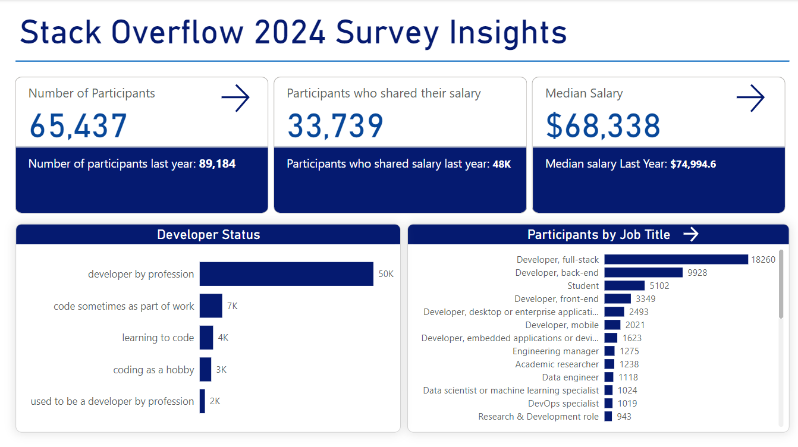
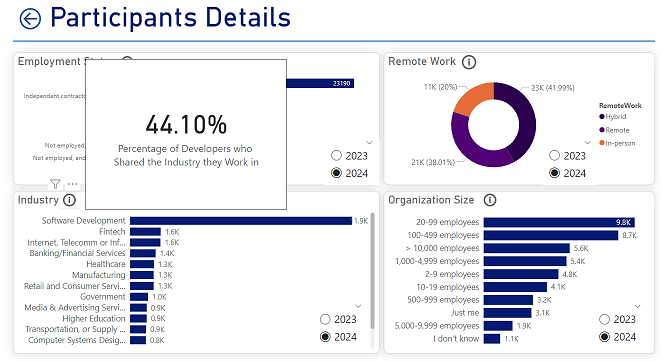
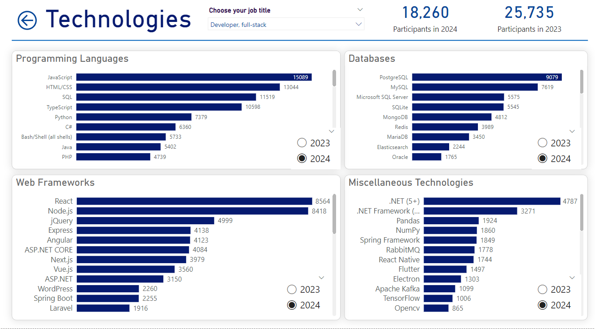
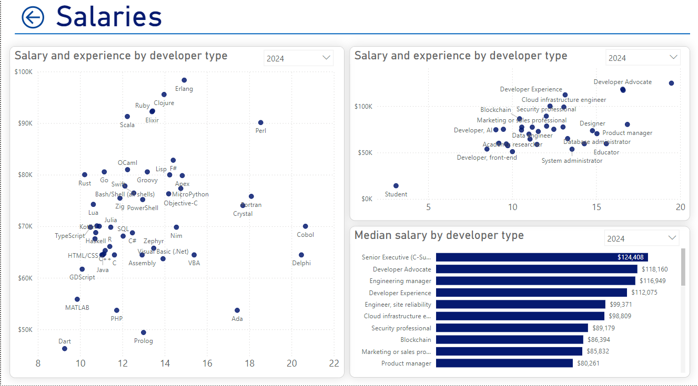

# Stack Overflow's 2024 Survey Analytics

This project analyzes data from Stack Overflow's 2024 Developer Survey to gain insights into:  
- **Popular technologies** across different job roles.  
- **Developers' salaries** by job title, programming languages, and years of experience.  
- **Comparisons** of trends and patterns with data from previous years.  

## Tools and Technologies  
- **Data Extraction and Transformation**: Python  
- **Data Modeling and Storage**: SQL  
- **Currency Conversion API**: Open Exchange Rates API  
- **Data Visualization**: Power BI 

## Project Workflow  
1. **Understanding the Data and Requirements**  
   - Analyzed the survey dataset to identify relevant columns and metrics.  
   - Defined key objectives for the analysis: technology trends, salary insights, and year-over-year comparisons

2. **Data Modeling**  
   Designed a star schema data model with:  
   - **Fact Table**: Granularity of one row per survey response.  
   - **Developer Dimension**: Includes attributes such as: developer status, job role, industry, organization size, and work environment (remote/hybrid/in-person).  
   - **Employment Status Table**: Handles the multivalued employment statuses associated with a response.  
   - **Technology Table**: Similar to `Employment Status` Table, it handles the multiple technologies accociated with one response. It has attributes such as technology name and technology type (e.g., programming language, database, web framework).  

3. **Data Transformation and Loading**  
   - Extracted data from the 2024 and 2023 survey responses using **Python**.  
   - Utilized **Pandas** library to perform transformations such as:  
     - Selecting relevant columns.  
     - Handling null values.  
     - Standardizing column names and values.  
     - Converting salaries to USD using the **Open Exchange Rates API**.  
   - Loaded the transformed data into the data model.  

4. **Data Analysis and Visualization**  
   - Imported the data model into **Power BI** to create an interactive report.  

## Power BI Report  
The report consists of four pages, each focusing on different aspects of the data:  

### 1. Summary Page  
- Key metrics:  
  - Number of participants.  
  - Participants who shared their salary.  
  - Median salary.  

for each metric the value of the same metric last year is shown to provide context.

- Visualizations:  
  - participants' developer statuses (e.g., professional, learning to code).  
  - Number of participants per job title.  

From the `Number of participants` card on the summary page you can navigate to the `Participants' Details` page to gain more insights on developers who participated in the survey. From the `Median salary` card you can navigate to the `Salaries` page to gain more insights on developers' salaries. From the `participants per job title` visual you can navigate to the `Technologies` page to gain more insights on different job roles and technologies associated with them.

### 2. Participants' Details Page  
- This page provides insights on:  
  - Employment status.  
  - Work environment (remote/hybrid/in-person).  
  - Industry.  
  - Organization size.  

For each visual in this page you can see results from this year and the last year to analyze trends and compare values. 

You can also see how many participants answered the question used to create this visual by hovering on the icon next to the visual title.

### 3. Technologies Page  
- On this page you can select a job title to view:  
  - The number of participants with this job role this year and last year. 
  - Popular technologies this year for the selected job role.  
  - For each visual you can compare this year's results with last year's results.  

### 4. Salaries Page  
- This page provides insights on:  
  - Median salary per job title.  
  - Salary variations by programming language.  
  - Salary trends by years of experience.  

